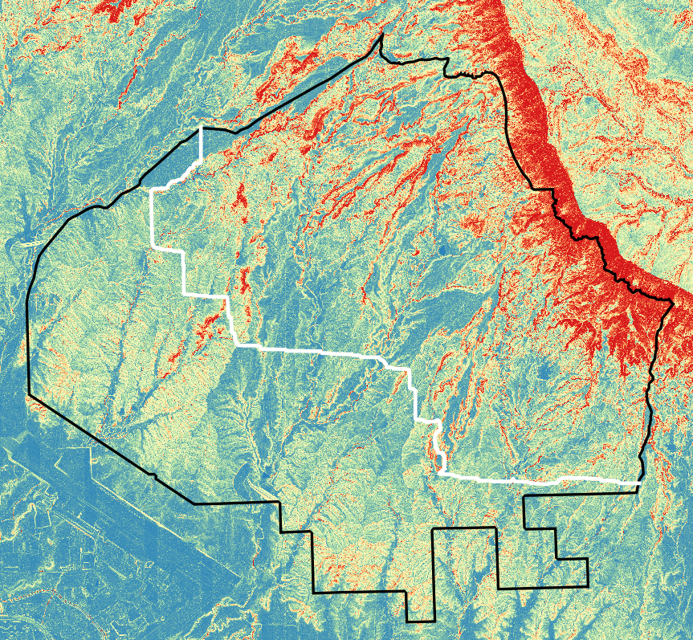

# QGis Image Pathfinder
QGis Image Pathfinder is a plugin for [QGis](https://www.qgis.org/en/site/) 3.0 and up which finds near-optimal paths in raster images.
## Installation
Follow these instructions to install and use this plugin
1. Download the repository as a .zip folder.
2. In QGis, go to Settings→User Profiles→Open Activate Profile Folder.
3. Extract the zipped folder and copy it into the `python/plugins/` subdirectory of the folder that opened.
4. Restart QGis.
5. In QGis, go to Processing→Toolbox or press Ctrl+Alt+T.
6. Open the "Find Paths" group and double-click on "Find Path". 
##Usage Example

